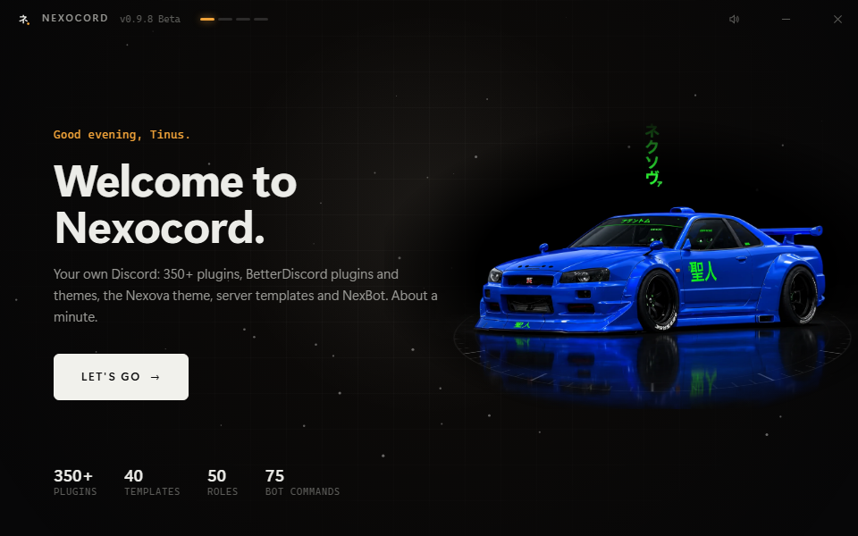

<div align="center">


<br>

[](https://github.com/Lokidook/Nexocord-releases/releases/latest)
[](https://github.com/Lokidook/Nexocord-releases/releases)
[](https://discord.gg/hSdSmySat8)
[](#license)

### Download

[](https://github.com/Lokidook/Nexocord-releases/releases/latest/download/Install.Nexocord.exe)
[](https://github.com/Lokidook/Nexocord-releases/releases/latest)
[](https://github.com/Lokidook/Nexocord-releases/releases/latest)
[](https://github.com/Lokidook/Nexocord-releases/releases/latest)

<sub>One file per platform. Nothing else to download.</sub>

</div>

<br>

## `01` What it is

**Nexocord** is a client mod for Discord: the app you already use, with a lot more under the hood. Think of it as a tuning kit.

| | |
|---|---|
| **350+ plugins** | Message logger, translations, better voice controls, quests, and hundreds more. Switch on what you want. |
| **BetterDiscord plugins and themes** | Built-in Plugin Manager with a **store of BetterDiscord's reviewed plugins**, one click to install. |
| **Nexova theme** | A night showroom behind glass panels, with weather that falls in it. Pick your car in the Garage. |
| **Templates & Roles** | Build a whole server from **40 templates** and **50 ready-made roles** in a minute. Share your own layout with friends as a code. |
| **NexBot** | The tool bot that goes with it: tickets, levels, giveaways, welcome, moderation and more, **75 commands**. |
| **Everywhere** | Windows, Linux, Android, iPhone and iPad. |

<br>

## `02` The Garage

<div align="center">

</div>

Three R34s, each with its own weather. All of it is drawn in CSS: Discord stays fast, and Eco mode switches every effect off at once.

<table>
<tr>
<td width="50%"><br><sub><b>BAYSIDE BLUE</b> · rain: slanted streaks at two depths, splashes on the floor, drops on the glass</sub></td>
<td width="50%"><br><sub><b>LIME GREEN</b> · thunderstorm: heavy rain, and now and then a small lightning bolt</sub></td>
</tr>
</table>

<br>

## `03` New in 0.9.9

| | |
|---|---|
| **A brand-new installer** | Your R34 on a showroom turntable, calmer screens, clear choices. |
| **Manage Nexocord** | Repair, safe mode, start without mods and uninstall in one clean screen. |
| **Nexocord in your taskbar** | Discord's window and shortcuts wear the Nexocord emblem. |
| **Readable voice tips** | Discord's voice panel tip is dark glass now instead of light text on white. |
| **Repairs itself** | A Discord update removed Nexocord? A notification, one click puts it back. |
| **Plugin store** | BetterDiscord's reviewed plugins, pinned to the exact reviewed version. |
| **Quiet hours and focus mode** | Do Not Disturb between two times, or hide everything except what you pick. |

<br>

## `04` Installing

<div align="center">

</div>

<details>
<summary><b>Windows</b></summary>

1. Download **[Install Nexocord.exe](https://github.com/Lokidook/Nexocord-releases/releases/latest/download/Install.Nexocord.exe)**.
2. Double-click it. If Windows says "Windows protected your PC", click **More info → Run anyway** (the installer isn't signed with a paid certificate).
3. **Let's go → Continue → Install Nexocord.** It closes Discord, installs, and starts Discord again.

To repair or remove it later: Start menu → **Nexocord Setup** → Manage.

Nexocord is in Discord's settings afterwards, and the Nexova theme is already on.
</details>

<details>
<summary><b>Linux</b></summary>

Download `Nexocord-<version>-linux.run` from the [latest release](https://github.com/Lokidook/Nexocord-releases/releases/latest), then:

```
bash Nexocord-<version>-linux.run
```

Works with Discord from .deb/.rpm, .tar.gz, the AUR and Flatpak. Snap can't be modded (Snaps are read-only).
</details>

<details>
<summary><b>Android</b> (test version)</summary>

1. Download `Nexocord-<version>.apk` on your phone from the [latest release](https://github.com/Lokidook/Nexocord-releases/releases/latest).
2. Open it and allow installing apps from your browser once.
3. Open **Nexocord** and log in.

It's Discord's computer layout scaled to the phone (pinch to zoom), so it's best on tablets and sideways. No push notifications.
</details>

<details>
<summary><b>iPhone and iPad</b> (test version)</summary>

Apple only allows App Store apps, so this goes through **AltStore** or **SideStore** (free):

1. Set up [AltStore](https://altstore.io) or [SideStore](https://sidestore.io) on your device.
2. Download `Nexocord-<version>.ipa` from the [latest release](https://github.com/Lokidook/Nexocord-releases/releases/latest).
3. In AltStore/SideStore: **+** → pick the IPA, then open **Nexocord** and log in.

With a free Apple ID the app has to be refreshed every 7 days (AltStore does that by itself).
</details>

<br>

## `05` Templates & Roles

<div align="center">

</div>

Right-click a server you own → **Templates & Roles**. Pick one of 40 templates (gaming, community, creators, support and more), choose roles from 50 ready-made ones with every permission explained, and Nexocord builds the server for you.

<br>

## `06` Good to know

- **Safe mode:** if a plugin misbehaves, start Discord in safe mode from Nexocord Setup; imported plugins are paused.
- **Start without mods:** Nexocord Setup can start a plain Discord once, without removing anything.
- **Client mods are against Discord's Terms of Service.** That's true for every client mod. In practice it's rarely acted on, but it's your call.
- **Help, bugs and ideas:** the [Nexocord Discord](https://discord.gg/hSdSmySat8).

<br>

## License

Nexocord is free software under the **GPL-3.0**, based on [Equicord](https://github.com/Equicord/Equicord) and [Vencord](https://github.com/Vendicated/Vencord). The full source code ships in every release folder (`source\`).
