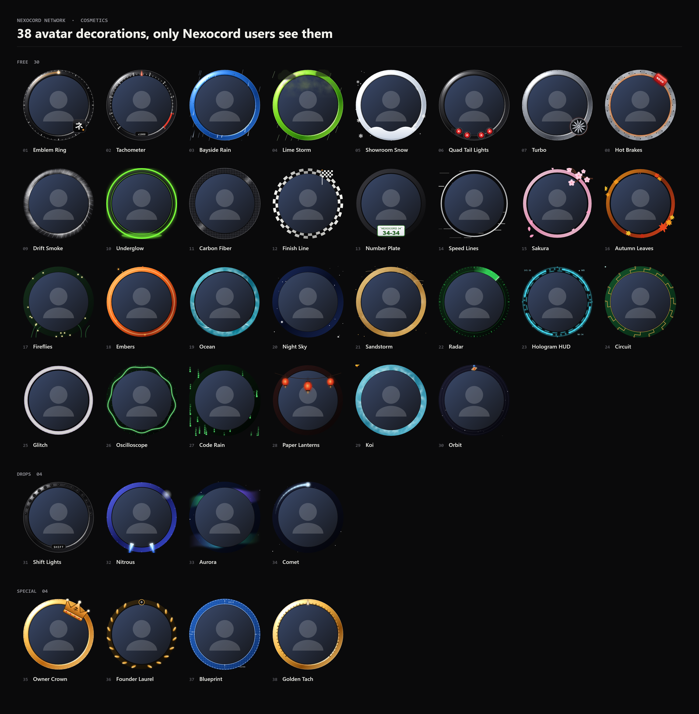
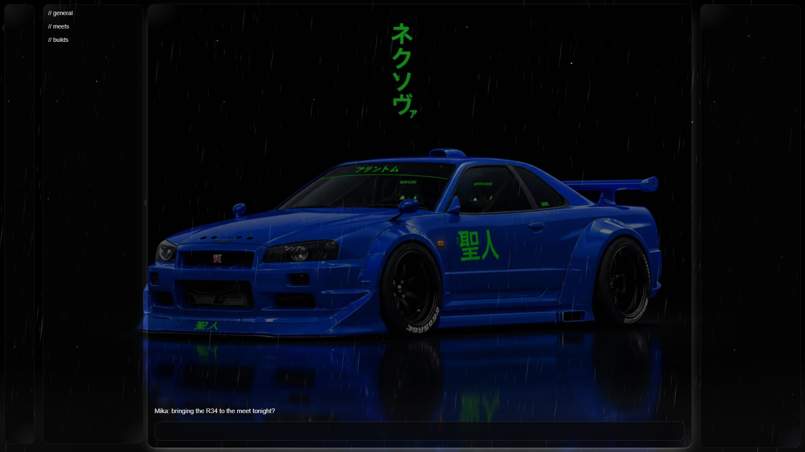
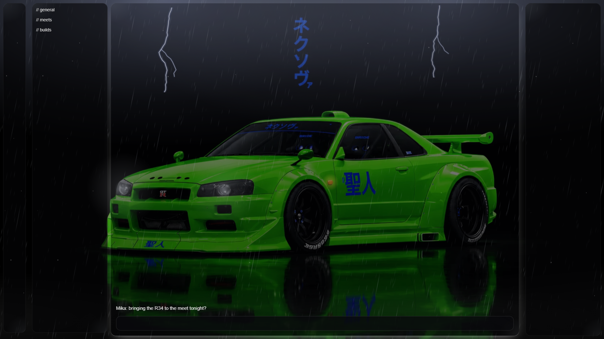
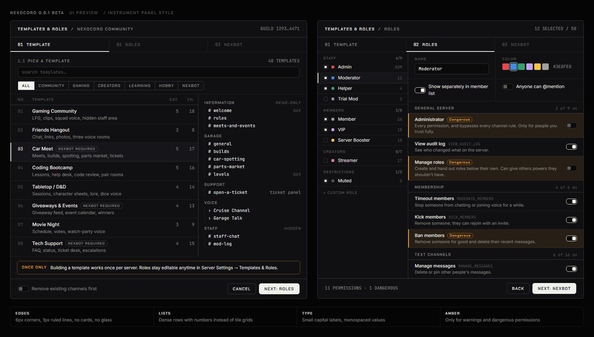

<div align="center">


<br>

**Discord, tuned.** 350+ plugins, the Nexova garage theme, server templates, its own bot and its own cosmetics.<br>
One installer. Windows, Linux, Android, iPhone and iPad.

<br>

[](https://github.com/Lokidook/Nexocord-releases/releases/latest)
[](https://github.com/Lokidook/Nexocord-releases/releases)
[](https://discord.gg/hSdSmySat8)
[](#license)

</div>

<br>

## Download

| Platform | File | Status |
|---|---|---|
| **Windows 10 / 11** | [**Install Nexocord.exe**](https://github.com/Lokidook/Nexocord-releases/releases/latest/download/Install.Nexocord.exe) | Stable beta |
| **Linux** | `Nexocord-<version>-linux.run` from the [latest release](https://github.com/Lokidook/Nexocord-releases/releases/latest) | Stable beta |
| **Android** | `Nexocord-<version>.apk` from the [latest release](https://github.com/Lokidook/Nexocord-releases/releases/latest) | Test version |
| **iPhone / iPad** | `Nexocord-<version>.ipa` from the [latest release](https://github.com/Lokidook/Nexocord-releases/releases/latest) | Test version |

One file per platform, nothing else to download. Step-by-step help is under [Installing](#08-installing).

<br>

## Contents

| | | |
|---|---|---|
| `01` [At a glance](#01-at-a-glance) | `05` [Templates & Roles](#05-templates--roles) | `09` [Help & troubleshooting](#09-help--troubleshooting) |
| `02` [New in 0.9.10](#02-new-in-0910) | `06` [NexBot](#06-nexbot) | `10` [Privacy](#10-privacy) |
| `03` [Cosmetics](#03-cosmetics) | `07` [Plugins](#07-plugins) | `11` [Version history](#11-version-history) |
| `04` [The Garage](#04-the-garage) | `08` [Installing](#08-installing) | [License](#license) |

<br>

## `01` At a glance

| | |
|---|---|
| **350+ plugins** | Message logger, translations, better voice controls, quests and hundreds more. Switch on only what you want. |
| **Nexova theme** | A night showroom behind glass, with your car and its weather. Eco mode turns every effect off at once. |
| **Nexocord Network** | The Nexocord badge on your profile and **38 free cosmetics** that only Nexocord users can see. |
| **Templates & Roles** | Build a full server from **40 templates** and **50 ready-made roles** in a minute. Share your layout as a code. |
| **NexBot** | The bot that comes with it: tickets, levels, giveaways, welcome, moderation, **75 commands**. |
| **BetterDiscord support** | Run BetterDiscord plugins and themes, with a store of its reviewed plugins built in. |
| **Takes care of itself** | Discord updated and Nexocord is gone? A notification, one click, it's back. |

<br>

## `02` New in 0.9.10

| | |
|---|---|
| **The Nexocord badge** | Every Nexocord user gets the Nexocord badge on their profile. It turns gray when someone stopped using Nexocord. |
| **Nexocord in Discord's Shop** | A new **Nexocord** tab right in Discord's Shop, with 38 avatar decorations. Everything is free. |
| **Equip them like Discord's** | Your Nexocord decorations show up in Discord's own *Change Decoration* window, in their own section. One decoration at a time: Discord's or Nexocord's. |
| **Drops and specials** | Some decorations are only free for a limited time; a few special ones are handed out by the Nexocord team. |
| **Installer fix** | "Unpatching… Failed" after a Discord update is fixed: the installer cleans up and patches again. |

<br>

## `03` Cosmetics

<div align="center">

</div>

Animated, with real light that travels around each ring, and sharp at any size. Open Discord's **Shop → Nexocord**, press **Get**, then **Equip**.

> Only people who use Nexocord see Nexocord badges and cosmetics. Everyone else sees your normal Discord profile. That's how every client mod works: nothing can change what the official Discord app shows.

<br>

## `04` The Garage

<div align="center">

</div>

Three R34s, each with its own weather, all drawn in CSS so Discord stays fast.

<table>
<tr>
<td width="50%"><br><sub><b>BAYSIDE BLUE</b> · rain in two depths, splashes on the floor, drops on the glass</sub></td>
<td width="50%"><br><sub><b>LIME GREEN</b> · thunderstorm: heavy rain and now and then a small bolt</sub></td>
</tr>
</table>

<br>

## `05` Templates & Roles

<div align="center">

</div>

Right-click a server you own → **Templates & Roles**.

1. Pick one of **40 templates**: gaming, community, creators, support, study and more.
2. Pick roles from **50 ready-made ones**. Every permission is explained, the risky ones are marked.
3. Nexocord builds the channels and roles for you. Want a friend's layout? Paste their share code.

<br>

## `06` NexBot

The tool bot for Nexocord servers. Invite it from Templates & Roles; it sets itself up in the channels the template made.

| Area | What it does |
|---|---|
| **Support** | Tickets as private threads, transcripts, staff claims |
| **Community** | Welcome messages, levels and level-up cards, giveaways, polls, starboard, birthdays |
| **Moderation** | Warnings, timeouts, automod, a full server log |
| **Fun** | Economy and shop, Connect Four, party games |

<br>

## `07` Plugins

Settings → **Nexocord** → Plugins. Search, switch on, done. A few favourites:

| Plugin | |
|---|---|
| **MessageLogger** | Keeps deleted and edited messages visible to you |
| **Translate** | Translate any message with one click |
| **QuietHours** | Do Not Disturb between two times, except for the people you pick |
| **FocusMode** | Hide everything except the servers and people you choose |
| **Plugin Manager** | BetterDiscord plugins and themes, with a store of reviewed plugins |

<br>

## `08` Installing

<details>
<summary><b>Windows</b></summary>

1. Download **[Install Nexocord.exe](https://github.com/Lokidook/Nexocord-releases/releases/latest/download/Install.Nexocord.exe)**.
2. Double-click it. If Windows says *"Windows protected your PC"*: **More info → Run anyway** (the installer isn't signed with a paid certificate).
3. **Let's go → Continue → Install Nexocord.** It closes Discord, installs, and starts Discord again.

Nexocord is in Discord's settings afterwards, and the Nexova theme is already on.<br>
Repair or remove it later: Start menu → **Nexocord Setup**.
</details>

<details>
<summary><b>Linux</b></summary>

Download `Nexocord-<version>-linux.run` from the [latest release](https://github.com/Lokidook/Nexocord-releases/releases/latest), then run:

```
bash Nexocord-<version>-linux.run
```

Works with Discord from .deb / .rpm, .tar.gz, the AUR and Flatpak. Snap can't be modded (Snaps are read-only).
</details>

<details>
<summary><b>Android</b> · test version</summary>

1. On your phone, download `Nexocord-<version>.apk` from the [latest release](https://github.com/Lokidook/Nexocord-releases/releases/latest).
2. Open it and allow installing apps from your browser once.
3. Open **Nexocord** and log in.

It's Discord's computer layout scaled to the phone (pinch to zoom), best on tablets and sideways. No push notifications.
</details>

<details>
<summary><b>iPhone and iPad</b> · test version</summary>

Apple only allows App Store apps, so this goes through **AltStore** or **SideStore** (both free):

1. Set up [AltStore](https://altstore.io) or [SideStore](https://sidestore.io).
2. Download `Nexocord-<version>.ipa` from the [latest release](https://github.com/Lokidook/Nexocord-releases/releases/latest).
3. In AltStore / SideStore: **+** → pick the IPA. Open **Nexocord** and log in.

With a free Apple ID, AltStore refreshes the app every 7 days by itself.
</details>

<br>

## `09` Help & troubleshooting

| Problem | Fix |
|---|---|
| Nexocord is gone after a Discord update | Click the Nexocord notification, or Start menu → **Nexocord Setup → Repair**. |
| The installer says *"Unpatching… Failed"* | Fixed in 0.9.10. Download the newest installer and run it again. |
| A plugin breaks Discord | **Nexocord Setup → Safe mode**: imported plugins pause until you leave safe mode. |
| You want plain Discord once | **Nexocord Setup → Start without mods.** Nothing gets removed. |
| You don't see your badge or cosmetics | Log in to the Nexocord Network once: the bar at the top of Discord, or **Shop → Nexocord → Log in**. |
| Anything else | Ask in the [Nexocord Discord](https://discord.gg/hSdSmySat8). |

<br>

## `10` Privacy

The Nexocord Network (badge and cosmetics) is optional. You log in with Discord's own **Authorize** window and only the **identify** permission: Nexocord never sees your password, messages or servers.

| Stored | Why |
|---|---|
| Discord user ID, username, avatar | To show your badge and cosmetics to other Nexocord users |
| Last time Nexocord was open, its version, the platform | For the gray "not used anymore" badge |
| The cosmetics you own and wear | So you keep them |

Hide your badge, log out, or delete everything about you any time: Settings → Nexocord → Plugins → **NexocordNetwork**.

> Client mods are against Discord's Terms of Service. That's true for every client mod. In practice it's rarely acted on, but it's your call.

<br>

## `11` Version history

<details>
<summary>Show all versions</summary>

| Version | Highlights |
|---|---|
| **0.9.10** | Nexocord Network: badge, 38 cosmetics, Nexocord tab in Discord's Shop and in the decoration picker. Installer fix for "Unpatching… Failed". |
| **0.9.9** | New installer with your R34 on a turntable, Manage screen, Nexocord emblem in the taskbar. |
| **0.9.8** | Repairs itself after Discord updates, update check, plugin store, server template sharing, quiet hours and focus mode, one-file Linux setup. |
| **0.9.7** | The Garage with real car renders, rain and thunderstorm, first Android app. |
| **0.9.6** | New community server, Garage scenes with their own weather. |
| **0.9.5** | The new installer (loading screen, cursor light, confetti), NexBot with 75 commands. |
| **0.9.1 – 0.9.4** | Templates & Roles, NexBot, the first installer, Linux setup. |

</details>

<br>

## License

Nexocord is free software under the **GPL-3.0**, built on [Equicord](https://github.com/Equicord/Equicord) and [Vencord](https://github.com/Vendicated/Vencord). Thanks to everyone who works on them.
