<div align="center">

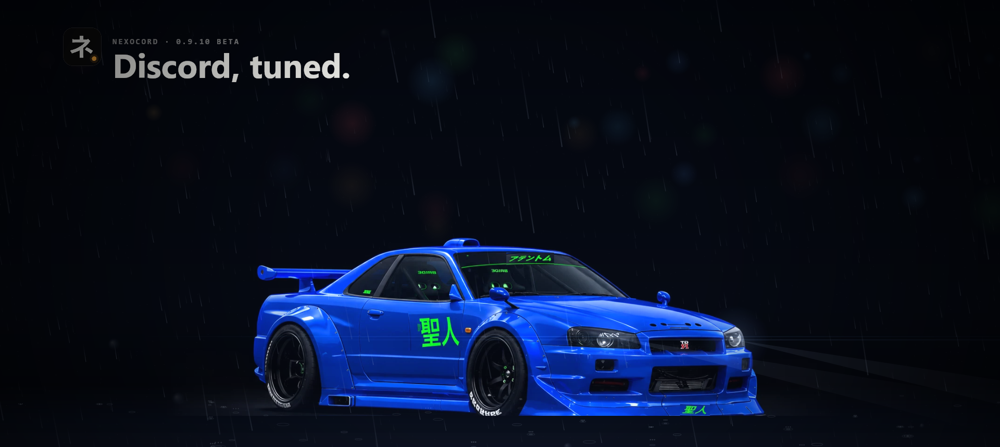

<h3>Discord, tuned.</h3>

350+ plugins · the Nexova garage theme · server templates · its own bot · its own badge and cosmetics

<br>

<a href="https://github.com/Lokidook/Nexocord-releases/releases/latest/download/Install.Nexocord.exe"></a>

<a href="https://github.com/Lokidook/Nexocord-releases/releases/latest"></a>
<a href="https://github.com/Lokidook/Nexocord-releases/releases/latest"></a>
<a href="https://github.com/Lokidook/Nexocord-releases/releases/latest"></a>

<br>

[](https://github.com/Lokidook/Nexocord-releases/releases/latest)
[](https://github.com/Lokidook/Nexocord-releases/releases)
[](https://discord.gg/hSdSmySat8)
[](#license)

</div>

<br>

<div align="center">
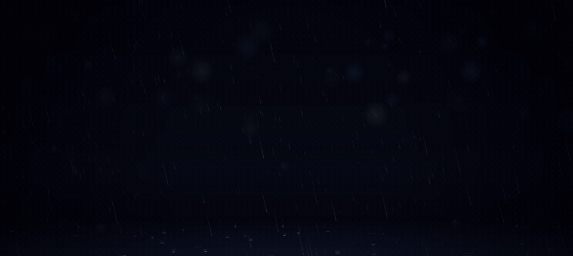
</div>

<br>

<table>
<tr>
<td width="25%" align="center"><h2>350+</h2><sub>PLUGINS</sub></td>
<td width="25%" align="center"><h2>40</h2><sub>SERVER TEMPLATES</sub></td>
<td width="25%" align="center"><h2>75</h2><sub>BOT COMMANDS</sub></td>
<td width="25%" align="center"><h2>4</h2><sub>PLATFORMS</sub></td>
</tr>
</table>

<br>

## `01` What's inside

<table>
<tr>
<td width="50%" valign="top">
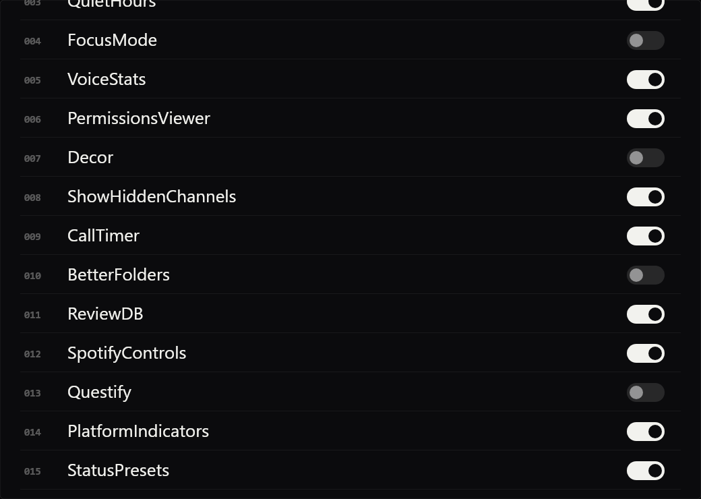
<h3>350+ plugins</h3>
Message logger, translations, voice tools, quests and hundreds more. Switch on only what you want. BetterDiscord plugins and themes work too, with a store of reviewed ones.
</td>
<td width="50%" valign="top">
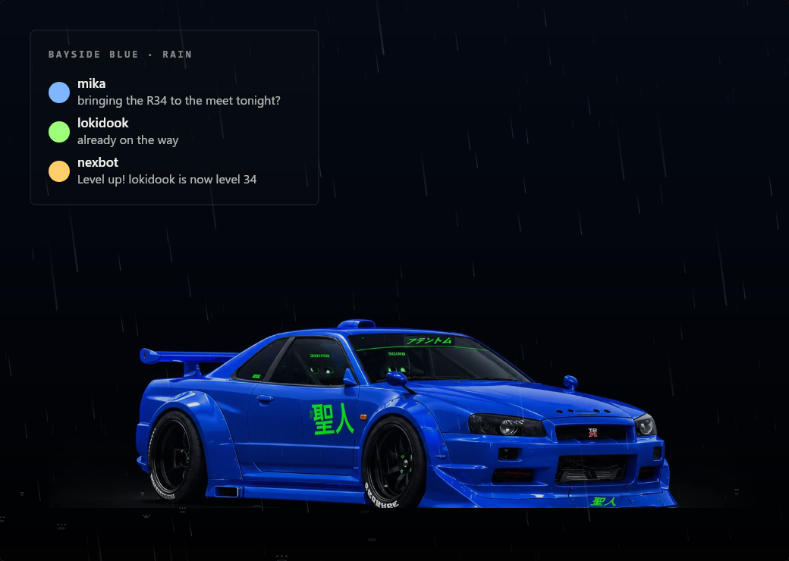
<h3>The Nexova garage</h3>
A night showroom behind glass. Pick your car and its weather: snow, rain or a thunderstorm. Eco mode turns every effect off at once.
</td>
</tr>
<tr>
<td width="50%" valign="top">
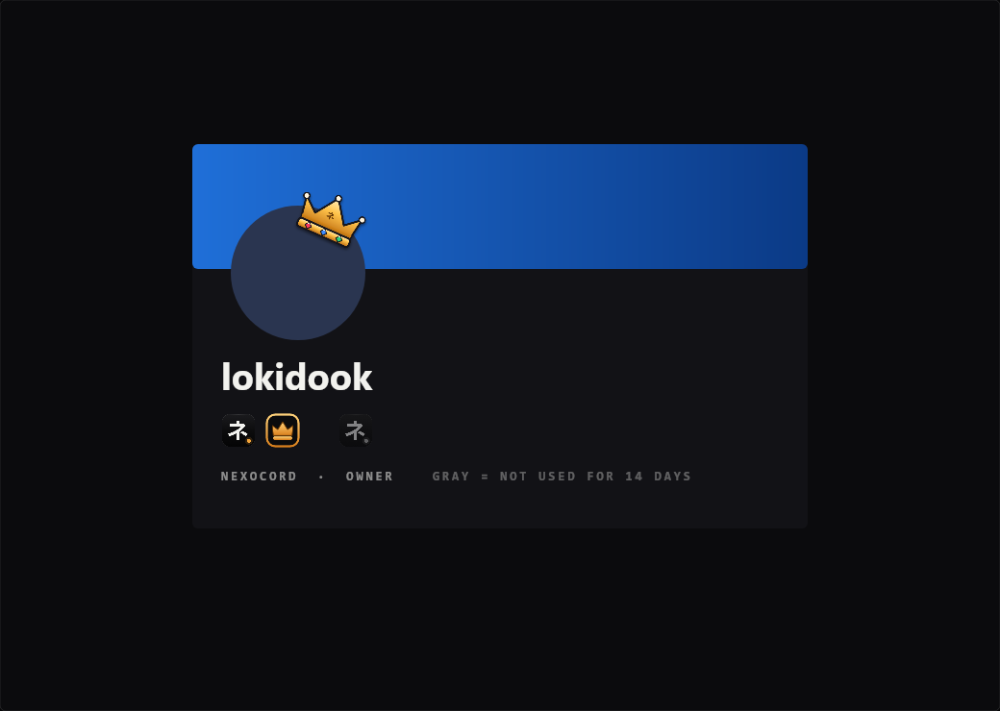
<h3>The Nexocord badge</h3>
Every Nexocord user wears it. It turns gray when someone stopped using Nexocord. <b>New in 0.9.10.</b>
</td>
<td width="50%" valign="top">
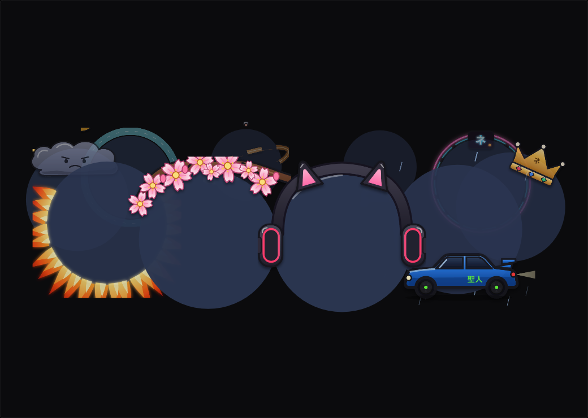
<h3>Free avatar decorations</h3>
A Nexocord tab in Discord's own Shop, and a Nexocord section in Discord's decoration picker. <b>New in 0.9.10.</b>
</td>
</tr>
<tr>
<td width="50%" valign="top">
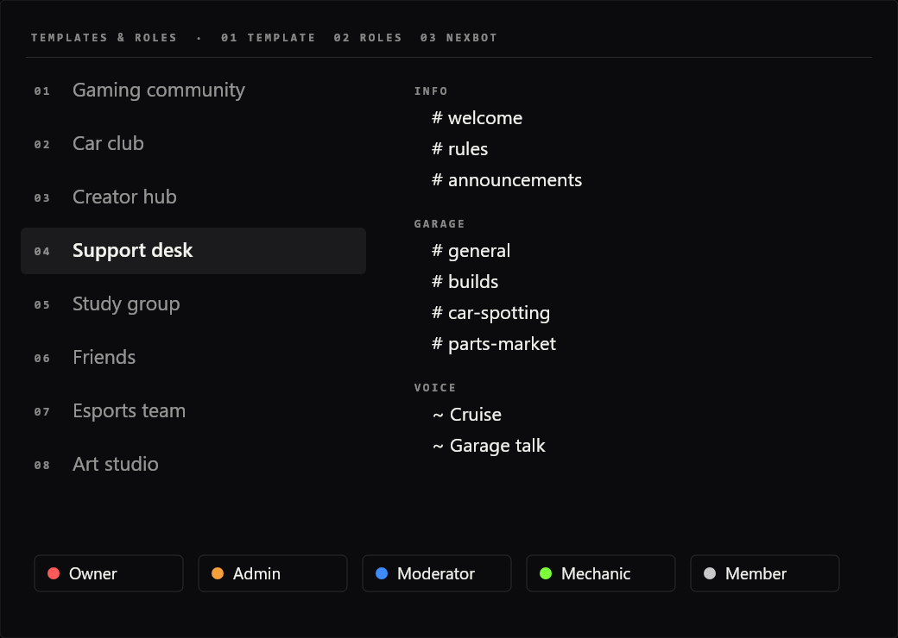
<h3>Templates & Roles</h3>
A whole server in a minute: 40 templates, 50 ready-made roles, every permission explained. Share your layout with friends as a code.
</td>
<td width="50%" valign="top">
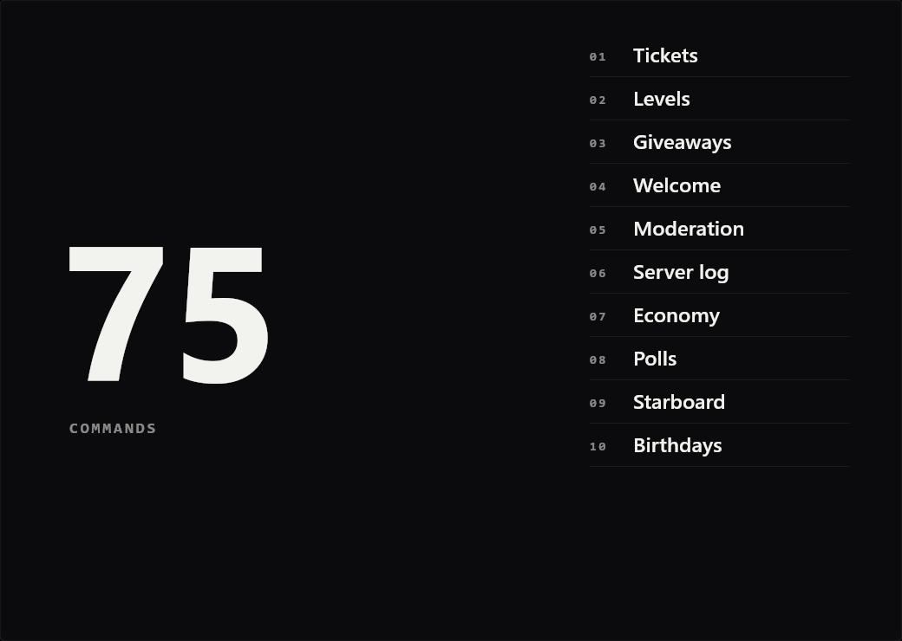
<h3>NexBot</h3>
The tool bot that comes with it: tickets, levels, giveaways, welcome, moderation, a server log. It sets itself up in the channels the template made.
</td>
</tr>
<tr>
<td width="50%" valign="top">
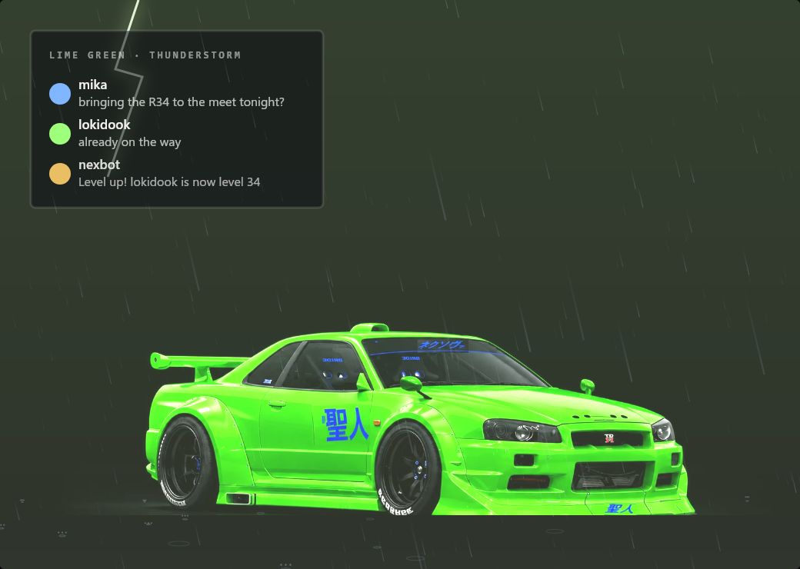
<h3>Lightning included</h3>
The Lime Green R34 in heavy rain, with a small bolt now and then. All drawn in CSS, so Discord stays fast.
</td>
<td width="50%" valign="top">
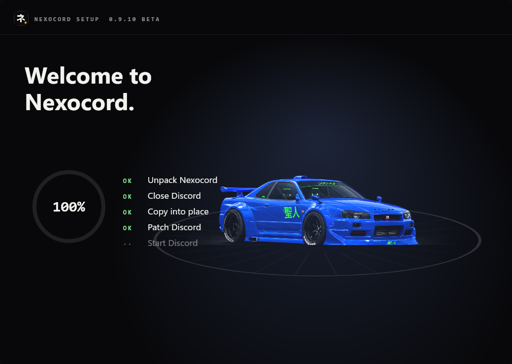
<h3>One click</h3>
A real installer: your car on a turntable while Nexocord installs. It repairs itself after Discord updates.
</td>
</tr>
</table>

<br>

## `02` The decorations

<div align="center">
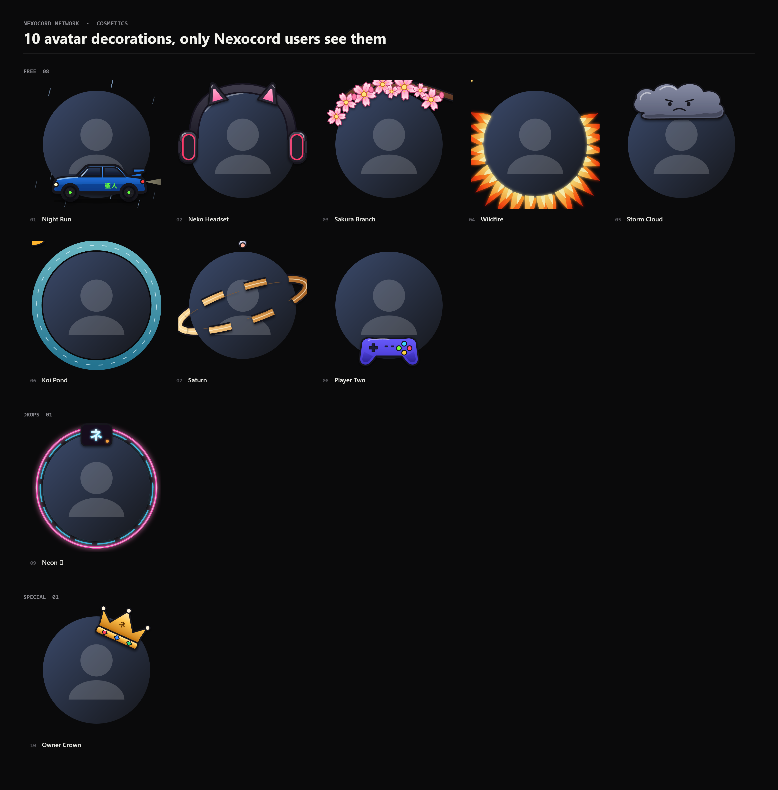
</div>

Illustrated like Discord's own, animated, sharp at any size, and **free**. Open **Shop → Nexocord**, press **Get**, then **Equip**: here or in Discord's *Change Decoration* window.

> Only people who use Nexocord see Nexocord badges and decorations. Everyone else sees your normal Discord profile. That's how every client mod works: nothing can change what the official Discord app shows.

<br>

## `03` Install

<table>
<tr>
<td width="50%" valign="top">

**Windows 10 / 11**

1. Download **[Install Nexocord.exe](https://github.com/Lokidook/Nexocord-releases/releases/latest/download/Install.Nexocord.exe)**.
2. Double-click it. *"Windows protected your PC"*? **More info → Run anyway** (no paid certificate).
3. **Let's go → Continue → Install Nexocord.** Discord closes, Nexocord goes in, Discord starts again.

Repair or remove later: Start menu → **Nexocord Setup**.
</td>
<td width="50%" valign="top">

**Linux**

Download `Nexocord-<version>-linux.run` from the [latest release](https://github.com/Lokidook/Nexocord-releases/releases/latest), then:

```
bash Nexocord-<version>-linux.run
```

Discord from .deb / .rpm, .tar.gz, the AUR or Flatpak. Snap can't be modded.
</td>
</tr>
<tr>
<td width="50%" valign="top">

**Android** · <sub>TEST VERSION</sub>

1. Download `Nexocord-<version>.apk` on your phone.
2. Open it, allow installing from your browser once.
3. Open **Nexocord** and log in.

Discord's computer layout, scaled. Best on tablets.
</td>
<td width="50%" valign="top">

**iPhone & iPad** · <sub>TEST VERSION</sub>

1. Set up [AltStore](https://altstore.io) or [SideStore](https://sidestore.io).
2. Download `Nexocord-<version>.ipa`.
3. In AltStore: **+** → pick the IPA → open **Nexocord**.

A free Apple ID refreshes it every 7 days by itself.
</td>
</tr>
</table>

<br>

## `04` New in 0.9.10

| | |
|---|---|
| **The Nexocord badge** | On every Nexocord user's profile. Gray when someone stopped using Nexocord. |
| **Nexocord in Discord's Shop** | A Nexocord tab with illustrated, animated decorations. All free. |
| **Equip them like Discord's** | Nexocord decorations have their own section in *Change Decoration*. One at a time: Discord's or Nexocord's. |
| **Installer fix** | No more *"Unpatching… Failed"* after a Discord update. |

<details>
<summary><b>Earlier versions</b></summary>

| Version | Highlights |
|---|---|
| **0.9.9** | New installer with your R34 on a turntable, Manage screen, Nexocord emblem in the taskbar. |
| **0.9.8** | Repairs itself after Discord updates, update check, plugin store, server sharing, quiet hours, focus mode, one-file Linux setup. |
| **0.9.7** | The Garage with real car renders, rain and thunderstorm, first Android app. |
| **0.9.6** | New community server, Garage scenes with their own weather. |
| **0.9.5** | The new installer (loading screen, cursor light, confetti), NexBot with 75 commands. |
| **0.9.1 – 0.9.4** | Templates & Roles, NexBot, the first installer, Linux setup. |

</details>

<br>

## `05` Help

| Problem | Fix |
|---|---|
| Nexocord is gone after a Discord update | Click the Nexocord notification, or **Nexocord Setup → Repair**. |
| The installer says *"Unpatching… Failed"* | Fixed in 0.9.10. Get the newest installer and run it again. |
| A plugin breaks Discord | **Nexocord Setup → Safe mode**: imported plugins pause. |
| Plain Discord, just once | **Nexocord Setup → Start without mods.** Nothing gets removed. |
| No badge, no decorations | Log in to the Nexocord Network once: the bar at the top of Discord, or **Shop → Nexocord → Log in**. |
| Anything else | The [Nexocord Discord](https://discord.gg/hSdSmySat8). |

<br>

## `06` Privacy

The badge and decorations are optional. You log in with Discord's own **Authorize** window and only the **identify** permission. Nexocord never sees your password, messages or servers.

**Stored:** your Discord ID, username and avatar (to show your badge), when Nexocord was last open, its version and platform (for the gray badge), and the decorations you own and wear.
**Your controls:** Settings → Nexocord → Plugins → **NexocordNetwork**: hide your badge, log out, or delete everything about you.

> Client mods are against Discord's Terms of Service. That's true for every client mod. In practice it's rarely acted on, but it's your call.

<br>

## License

Free software under the **GPL-3.0**, built on [Equicord](https://github.com/Equicord/Equicord) and [Vencord](https://github.com/Vendicated/Vencord). Thanks to everyone who works on them.
